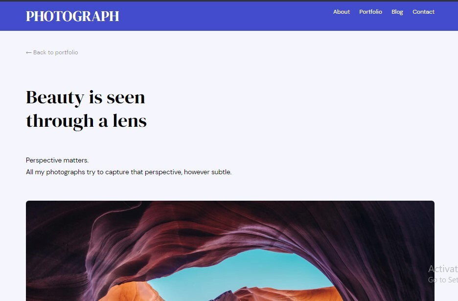
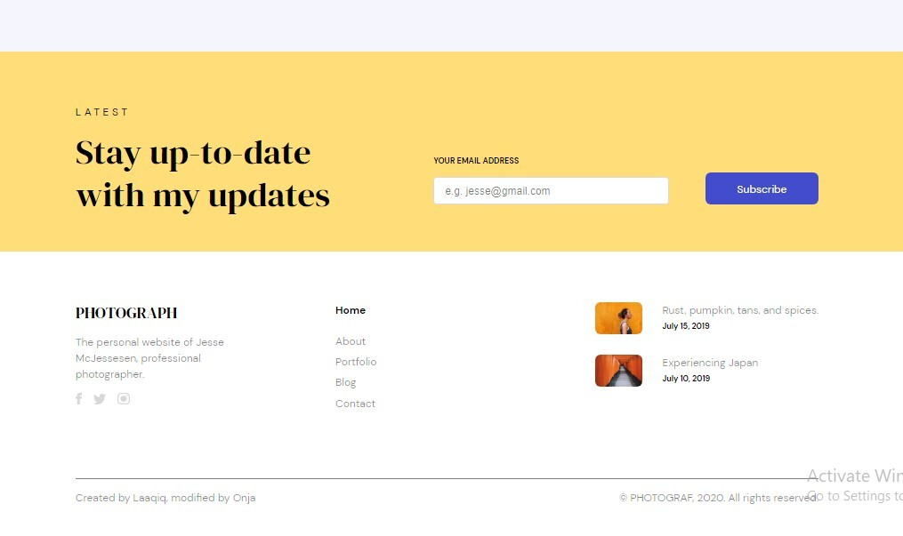

<h1 align="center">Photograph Responsive</h1>

## Overview




## Built With
This website is built with:
 - [HTML](https://www.google.com/search?q=html&rlz=1C1AVFC_enMG885MG885&oq=html&aqs=chrome..69i57j0l2j69i61j69i60l2j69i65l2.1712j0j1&sourceid=chrome&ie=UTF-8)

 - [SCSS](https://sass-lang.com/guide)

 - [Vanilla Javascript](https://developer.mozilla.org/en-US/docs/Web/JavaScript)


## Design
You can find the desing online at:[ figma.com/Laaqiq-1-Portfolio-detail-Responsive](figma.com/Laaqiq-1-Portfolio-detail-Responsive)
## How to use

To clone and run this application, you'll need [Git](https://git-scm.com) and [Node.js](https://nodejs.org/en/download/) (which comes with [npm](http://npmjs.com)) installed on your computer. From your command line:

```bash
# Clone this repository
$ git clone https://github.com/your-user-name/your-project-name

# Install dependencies
$ npm install

# Run the app
$ npm start
```

## Live app
[https://photograph-landing-page-sandy.netlify.app](https://photograph-landing-page-sandy.netlify.app)
